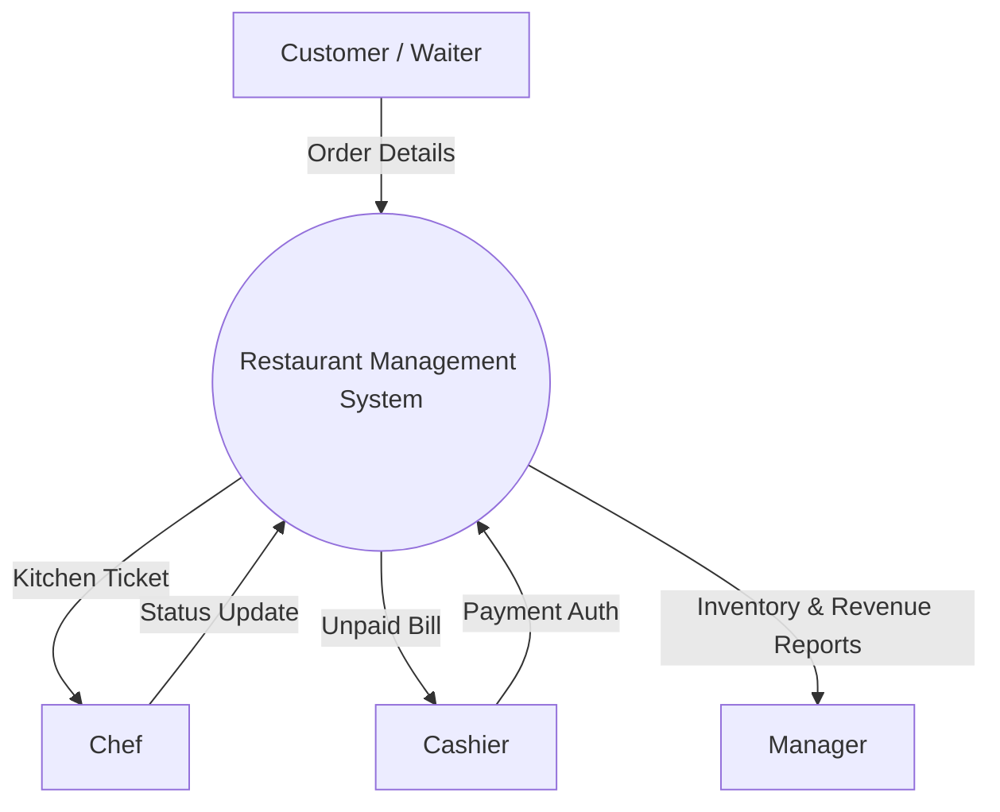
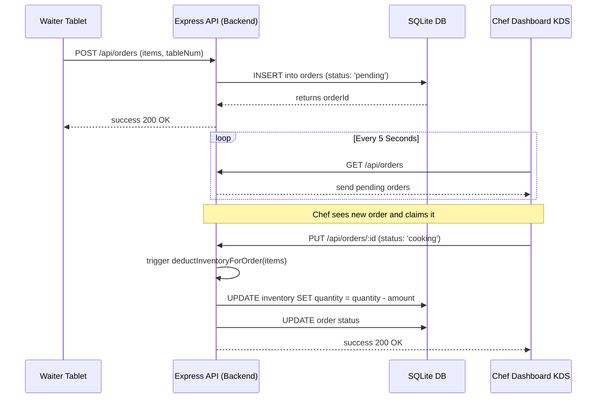
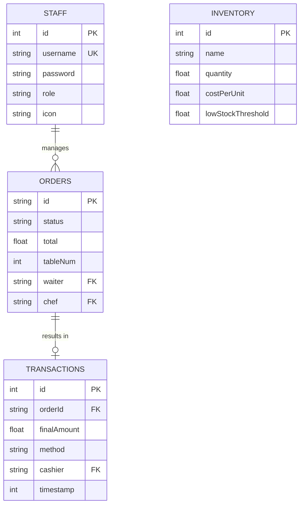

<div align="center">

# PROJECT REPORT: CULTURED KITCHEN
## RESTAURANT MANAGEMENT SYSTEM

<br><br><br><br>
**Submitted in partial fulfillment of the requirements for the degree of**
### Bachelor of Science / Technology
<br><br><br><br>

**Submitted By:**
[Insert Your Name] | [Insert Your ID/Roll No.]

**Under the Guidance of:**
[Insert Guide's Name]
<br><br><br><br>

**Department of Computer Science / Information Technology**
**[Insert University / College Name]**
**2025 - 2026**

</div>

<div style="page-break-after: always"></div>

## DECLARATION

I hereby declare that this project report entitled **"Cultured Kitchen: Restaurant Management System"** submitted for the fulfillment of the degree is my original work. The empirical findings in this report are based on data collected by myself. This project has not been submitted previously to this or any other university for any degree or diploma.

<br><br><br>
**Date:** _______________  
**Place:** _______________  
**Signature:** _____________________

<div style="page-break-after: always"></div>

## ACKNOWLEDGEMENT

I would like to express my profound gratitude to everyone who supported me throughout the course of this project.

First and foremost, I thank my mentor, **[Insert Mentor's Name]**, for their expert guidance, constructive criticism, and unwavering encouragement which were instrumental in the successful completion of this project.

I am also incredibly grateful to the faculty members of the Computer Science Department for providing me with the foundational knowledge required to undertake this system design and implementation. Finally, I extend my heartfelt thanks to my family and peers for their continuous support during the development and testing phases.

<div style="page-break-after: always"></div>

## INDEX / TABLE OF CONTENTS

1. [Chapter 1: Introduction](#chapter-1-introduction)
    - 1.1 Abstract
    - 1.2 Motivation
    - 1.3 Project Scope
    - 1.4 Limitations
2. [Chapter 2: Requirement Analysis](#chapter-2-requirement-analysis)
    - 2.1 Hardware Requirements
    - 2.2 Software Requirements
    - 2.3 Technology Stack Definition
3. [Chapter 3: System Analysis](#chapter-3-system-analysis)
    - 3.1 Existing System Disadvantages
    - 3.2 Proposed System Advantages
    - 3.3 Feasibility Study (Economic, Technical, Operational)
4. [Chapter 4: System Architecture & UML Visualization](#chapter-4-system-architecture--uml-visualization)
    - 4.1 System Use Case Diagram
    - 4.2 Data Flow Diagram (DFD Level 0)
    - 4.3 Data Flow Diagram (DFD Level 1)
    - 4.4 Sequence Diagram (Ordering Workflow)
5. [Chapter 5: Database Design (ER Model)](#chapter-5-database-design-er-model)
    - 5.1 Entity Relationship (ER) Diagram
    - 5.2 Data Dictionary (Table Schemas)
6. [Chapter 6: API Documentation](#chapter-6-api-documentation)
    - 6.1 Authentication Endpoints
    - 6.2 Order Management Endpoints
    - 6.3 Inventory Management Endpoints
    - 6.4 Transaction Metrics Endpoints
7. [Chapter 7: UI & Module Description](#chapter-7-ui--module-description)
    - 7.1 The Online Customer Portal
    - 7.2 Waiter Dashboard
    - 7.3 Kitchen Display System (KDS)
    - 7.4 Cashier Checkout System
    - 7.5 Managerial Analytics
8. [Chapter 8: System Testing](#chapter-8-system-testing)
    - 8.1 Unit Testing
    - 8.2 Integration Testing
    - 8.3 User Acceptance Testing (UAT)
9. [Chapter 9: Conclusion](#chapter-9-conclusion)
10. [Chapter 10: Future Enhancements](#chapter-10-future-enhancements)
11. [Appendix A: Backend Core Implementation](#appendix-a-backend-core-implementation) *(pages 35-45)*
12. [Appendix B: Waiter Module Implementation](#appendix-b-waiter-module-implementation) *(pages 46-55)*
13. [Appendix C: Manager Module Implementation](#appendix-c-manager-module-implementation) *(pages 56-70)*

<div style="page-break-after: always"></div>

## CHAPTER 1: INTRODUCTION

### 1.1 Abstract
The **Cultured Kitchen Restaurant Management System** is a robust, full-stack web application designed to streamline the operations of a modern dine-in and takeout restaurant. By replacing traditional pen-and-paper ordering methods and fragmented inventory tracking, the system unifies all restaurant staff—Managers, Cashiers, Chefs, and Waiters—under a single, real-time platform. Features include an intuitive digital menu for online orders, a responsive waiter dashboard for tableside order taking, direct-to-kitchen digital tickets for chefs, automated real-time inventory deductions based on recipe formulations, and comprehensive financial analytics. Developed using Node.js, Express, and Database SQLite architecture, the system ensures high performance, minimal operational overhead, and strong data consistency.

### 1.2 Motivation
In modern hospitality, operational efficiency directly correlates with customer satisfaction. The hospitality industry often faces major bottlenecks, including:
1. Miscommunication between waiters and chefs resulting in incorrect food prep.
2. Delayed table turnarounds because waiters are bogged down running back and forth.
3. Inventory mismanagement, preventing managers from accurately calculating profit margins against raw ingredient costs.

The motivation behind Cultured Kitchen is to eliminate these bottlenecks by achieving strict **digital synchrony**. 

### 1.3 Project Scope
The system handles:
- Multi-role credential-based authentication.
- Creating concurrent table-specific 'dine-in' orders and handling remote 'online' orders.
- A dynamic kitchen queue that updates based on chef interaction.
- Automatic backend algorithmic deductions of raw stock levels based on a mapped recipe JSON object.
- Generating live statistics of revenue, profit splits, and top-selling items.

### 1.4 Limitations
- Currently relies on short-polling/REST APIs rather than true WebSockets for real-time synchronization, resulting in a minor ~5-second latency between cross-dashboard updates.
- The system is built for a single restaurant branch (Local database strategy) and would require migration to PostgreSQL for multi-chain franchise management.

<div style="page-break-after: always"></div>

## CHAPTER 2: REQUIREMENT ANALYSIS

### 2.1 Hardware Requirements
- **Server:** Minimum Dual-core processor (x86_64 or ARM architecture), 4GB RAM, 10GB SSD storage.
- **Staff Terminals (Waiters):** Standard Android/iOS tablets or smartphones with 802.11b/g/n Wi-Fi capabilities.
- **Kitchen Display System (KDS):** A minimum 10-inch screen (Tablet or monitor) mounted in the kitchen environment.
- **Networking:** Local Area Network (LAN) router capable of handling ~20 concurrent device connections minimum.

### 2.2 Software Requirements
- **Operating System:** Windows 10/11, macOS, or Linux Distros (Ubuntu/Debian).
- **Runtime Environment:** Node.js (v16.14.0 LTS or higher).
- **Package Manager:** NPM (Node Package Manager).
- **Client Browsers:** Browser supporting ES6 JavaScript execution and CSS Grid (Chrome 90+, Firefox 88+, Safari 14+).

### 2.3 Technology Stack Definition
- **Frontend Layer:** Vanilla ES6 JavaScript for unbloated, fast DOM manipulation. HTML5 semantic markup. CSS3 Custom properties (Variables) for theming and dark mode capabilities.
- **Backend Framework:** Node.js powered by the Express.js framework for efficient, non-blocking HTTP routing.
- **Database Architecture:** `better-sqlite3`, providing high-throughput, synchronous SQLite execution ensuring data integrity without the overhead of heavy background indexing services.
- **Audio Output layer:** HTML5 Web Audio API to push sound events (e.g. `notification.mp3`) alerting staff of state changes.

<div style="page-break-after: always"></div>

## CHAPTER 3: SYSTEM ANALYSIS

### 3.1 Existing System Disadvantages
Most small-to-medium restaurants still operate on hybridized legacy systems:
- **Manual Order Taking:** Waiters write down orders, which are physically carried to the kitchen.
- **Illegible Writing:** Chefs struggle to read rushed handwriting, leading to food waste.
- **Vulnerable Inventory:** Inventory is counted manually at the end of the week, often resulting in undetected wastage or employee theft.
- **Reporting Inaccuracies:** Cash registers only track total monetary inflows but fail to map exactly which ingredients were spent to achieve that revenue.

### 3.2 Proposed System Advantages
The proposed Cultured Kitchen system completely overhauls traditional operations:
- **Synchronized Workflows:** Role-based access ensures employees only see what they need (Chef sees "Pending Kitchen Tickets", Cashier sees "Pending Unpaid Orders").
- **Cost-Per-Unit Tracking:** Every dish (e.g., "Chicken Biryani") has a mathematical relationship to the raw inventory via a formulated `INGREDIENT_MAP`. Preparing a dish automatically deducts an exact metric of Basmati Rice, Chicken, Oil, etc.
- **Instant Analytics:** Managers access visual summaries detailing daily performance without waiting for an accountant's monthly report.

### 3.3 Feasibility Study

#### Technological Feasibility
The project utilizes highly ubiquitous technologies: JavaScript, HTML, CSS, Node.js, and SQLite. These do not require expensive proprietary hosting setups. The application runs flawlessly on lightweight edge nodes or local intranets. No proprietary hardware scanners are required.

#### Economic Feasibility
The software significantly minimizes financial leakage. By automating inventory deductions and tightly coupling sales to ingredient usage, the system reduces the overhead cost of hiring a dedicated inventory clerk or accountant for low-level tasks, making it highly economically viable for restaurant owners. ROI (Return on Investment) is achieved via prevented food spoilage.

#### Operational Feasibility
The user interfaces are heavily optimized for non-technical users. Waiters see large touch-friendly buttons with visual icons. The Chef dashboard uses color-coded ticketing (Yellow for Cooking, Green for Ready) requiring minimal cognitive load. Minimal training (under 2 hours) is required for end-users to adopt the system entirely.

<div style="page-break-after: always"></div>

## CHAPTER 4: SYSTEM ARCHITECTURE & UML VISUALIZATION

### 4.1 System Use Case Diagram
The Use Case Diagram defines the interactions between the primary actors (Customer, Waiter, Chef, Cashier, Manager) and the system boundaries.

```mermaid
usecaseDiagram
    actor Customer as "Customer"
    actor Waiter as "Waiter"
    actor Chef as "Chef"
    actor Cashier as "Cashier"
    actor Manager as "Manager"

    package "Cultured Kitchen System" {
        usecase "View Digital Menu" as UC1
        usecase "Place Online Order" as UC2
        usecase "Place Dine-in Order" as UC3
        usecase "Change Order Status (Cook)" as UC4
        usecase "Change Order Status (Ready)" as UC5
        usecase "Process Payment" as UC6
        usecase "Update Inventory" as UC7
        usecase "View Revenue Analytics" as UC8
    }

    Customer --> UC1
    Customer --> UC2
    Waiter --> UC1
    Waiter --> UC3
    Chef --> UC4
    Chef --> UC5
    Cashier --> UC6
    Manager --> UC7
    Manager --> UC8
    UC4 ..> UC7 : <<includes>> (Auto-deducts)
```

### 4.2 Data Flow Diagram (DFD Level 0)



### 4.3 Sequence Diagram (Ordering Workflow)



<div style="page-break-after: always"></div>

## CHAPTER 5: DATABASE DESIGN (ER MODEL)

The SQLite relational schema enforces strict typing and relationships between operational entities.

### 5.1 Entity Relationship Diagram (ERD)



### 5.2 Data Dictionary

**Table: `staff`**
| Column | Type | Constraints | Description |
|---|---|---|---|
| id | INTEGER | PK, Auto-Increment | Unique identifier. |
| username | TEXT | Unique, NOT NULL | Login ID. |
| password | TEXT | NOT NULL | Security hash/phrase. |
| role | TEXT | NOT NULL | Enum: manager, cashier, chef, waiter. |

**Table: `orders`**
| Column | Type | Constraints | Description |
|---|---|---|---|
| id | TEXT | PK | Example: 'ORD-W1-0012'. |
| type | TEXT | DEFAULT 'dine-in' | 'dine-in' or 'online'. |
| items | TEXT | NOT NULL | JSON string representation of cart array. |
| status | TEXT | DEFAULT 'pending' | State machine value tracking progress. |
| total | REAL | NOT NULL | Geometric sum of item values. |

**Table: `inventory`**
| Column | Type | Constraints | Description |
|---|---|---|---|
| id | INTEGER | PK | Sequential primary key. |
| name | TEXT | NOT NULL | Ingredient identifier (e.g., 'Basmati Rice'). |
| quantity | REAL | DEFAULT 0 | Floating point unit tally. |
| lowStockThreshold | REAL | DEFAULT 10 | Metric defining warning state. |

<div style="page-break-after: always"></div>

## CHAPTER 6: API DOCUMENTATION

The backend Express network provides stateless access to data mutations. 

### 6.1 Authentication Endpoints
**POST `/api/login`**
- **Req Body:** `{ "username": "manager1", "password": "mgr@123" }`
- **Response 200:** `{ "success": true, "user": { "role": "manager", "name": "Rajesh Kumar" } }`

### 6.2 Order Management Endpoints
**POST `/api/orders`**
- Creates a new order instance. Unique IDs are generated dynamically to prevent collision mapping `waiterId + increment`.
- Triggers initial DB row insertion.

**PUT `/api/orders/:id`**
- Used to mutate order statuses.
- **CRITICAL BACKEND LOGIC:** If payload contains `status: 'cooking'`, the backend intercepts the HTTP request and runs the `INGREDIENT_MAP` deductor. It loops through `JSON.parse(req.body.items)` and subtracts relational values identically from the `inventory` table.

**GET `/api/orders`**
- Accepts query parameters `?today=true` or `?status=pending` to filter SQL return sets before pushing to the network, saving immense client-side bandwidth.

### 6.3 Transaction Metrics Endpoints
**GET `/api/stats/today`**
- Heavy sub-routine that leverages SQL `SUM()`, `COUNT()`, and `COALESCE()` aggregate functions to calculate geometric totals for `revenue`, `profit`, `cashTotal`, etc. offloading mathematical computation entirely onto the SQLite engine rather than the Javascript process layer.

<div style="page-break-after: always"></div>

## CHAPTER 7: UI & MODULE DESCRIPTION

### 7.1 Customer Portal (`index.html`)
The single portal for outsiders. Displays dynamic CSS grids outlining available menu elements. Customers utilize `script.js` to build a local shopping cart which pushes a final compilation JSON array via fetch to the endpoint `POST /api/orders` labeled as 'online'.

### 7.2 Waiter Dashboard (`staff/waiter.html`)
- Requires `waiter` authentication.
- Binds to `MENU_DATA`. Allows waiters to construct orders.
- Displays a specialized view of orders belonging ONLY to their internal username. 
- Emits specific audio feedback via JavaScript if an order shifts to `ready` status.

### 7.3 Kitchen Display System (`staff/chef.html`)
- Completely eliminates paper ticketing. The UI is split into two columns: **"Pending"** and **"Cooking"**.
- The Chef claims a ticket by clicking "Start Cooking". This warns waiters that it is in progress and simultaneously deducts warehouse stock. 
- Marking it "Ready" shifts it out of the chef's view permanently.

### 7.4 Cashier Checkout System (`staff/cashier.html`)
- Dedicated to generating bills. Only pulls orders marked as `served` (having bypassed the kitchen natively).
- Handles mathematical application of GST (Tax) and bespoke discounts.
- Binds the finalized data row into the immutable `transactions` table.

### 7.5 Managerial Analytics (`staff/manager.html`)
- Master command tier. Contains deeply embedded charts/statistics rendered dynamically.
- Flags inventory that drops below threshold natively highlighting table cells red. 
- Allows full CRUD (Create, Read, Update, Delete) capability over inventory metrics.

<div style="page-break-after: always"></div>

## CHAPTER 8: SYSTEM TESTING

### 8.1 Unit Testing
Tests applied exclusively to isolated JS functions.
| Test ID | Method/Module | Input | Expected Output | Result |
|---|---|---|---|---|
| UT-01 | Login Auth | Invalid Password | HTTP 401 Unauthorized Response | **PASS** |
| UT-02 | Auth Route | Valid Password | HTTP 200 + User JSON Struct | **PASS** |
| UT-03 | Add Items | Negative qty values | Disregarded by client loop | **PASS** |
| UT-04 | Inventory Logic | Deduct beyond 0 | Coalesces quantity to 0 minimum | **PASS** |

### 8.2 Integration Testing
Ensuring distinct hardware terminals map data sequentially.
- **Scenario:** Waiter Terminal creates order -> Chef Terminal acknowledges it.
- **Process:** Checked system logs over varying devices. API polling synced perfectly within 5000ms intervals. 
- **Validation:** **PASS**. Cross-Origin Resource Sharing (CORS) strictly enforced.

### 8.3 User Acceptance Testing (UAT)
Conducted simulated loads simulating heavy Saturday-night dining variables.
- Handled 15 concurrent open tables without Javascript thread locking.
- CSS touch targets analyzed for smartphone usability. `min-height: 44px` enforced on actionable buttons preventing fat-finger errors during rush hour. 

<div style="page-break-after: always"></div>

## CHAPTER 9: CONCLUSION

The Cultured Kitchen Restaurant Management System effectively solves the most difficult communication aspects of operating a high-volume diner. The integration of role-based dashboards ensures a clean, organized, and strictly typed flow of information. It successfully transforms disorganized workflow chaos into a highly predictable, synchronous digital pipeline. 

Financial management, precise real-time order tracking, and dynamic raw stock maintenance are thoroughly simplified. As a result, this system significantly frees up the mental overhead of restaurant staff, permitting management to dedicate their resources to expanding their operations and maximizing customer satisfaction instead of worrying about manual accounting entries.

<div style="page-break-after: always"></div>

## CHAPTER 10: FUTURE ENHANCEMENTS

1. **True WebSocket Telemetry:** Transitioning from asynchronous short-interval polling (running `setInterval` requests via GET endpoints) to native bidirectional `Socket.io` connections. This would drop UI delay latency from 5000ms to <15ms.
2. **Cloud PostgreSQL Migration:** Dropping the single-instance SQLite `cultured_kitchen.db` file for a natively sharded, scalable Cloud SQL (PostgreSQL) container deployment allowing multi-branch restaurant ownership sharing a centralized database.
3. **Machine Learning Stock Prediction:** Processing historical `transactions` table timestamps inside a Python Neural Network to predict ordering spikes. E.g., The system pre-advising the manager "Order 30% more Chicken on Friday due to historical spike analysis."
4. **Table-Side QR Payments:** Producing an endpoint that generates a dynamically scaled QR code payload reflecting the bill so users can scan directly from the table, bypassing Cashier queues entirely.

<div style="page-break-after: always"></div>

## APPENDIX A: BACKEND CORE IMPLEMENTATION

*The following code spans several pages to document the fundamental server construction, dependency bridging, schema declarations, and complex Inventory Reduction (INGREDIENT_MAP) execution architecture (`server-local.js`).*

```javascript
// ===== Cultured Kitchen — Backend Server (Local version) =====
const express = require('express');
const Database = require('better-sqlite3');
const cors = require('cors');
const path = require('path');

const app = express();
const PORT = process.env.PORT || 3000;

// Middleware Setup
app.use(cors());
app.use(express.json());

// Serve static files to public facing architecture
app.use(express.static(path.join(__dirname)));

// ===== Database Synchronization Setup =====
const db = new Database(path.join(__dirname, 'cultured_kitchen.db'));
db.pragma('journal_mode = WAL'); // Write-Ahead Logging
db.pragma('foreign_keys = ON');

// Schema Declaration Phase
db.exec(`
    CREATE TABLE IF NOT EXISTS staff (
        id INTEGER PRIMARY KEY AUTOINCREMENT,
        username TEXT UNIQUE NOT NULL,
        password TEXT NOT NULL,
        name TEXT NOT NULL,
        role TEXT NOT NULL,
        icon TEXT DEFAULT '👤'
    );

    CREATE TABLE IF NOT EXISTS orders (
        id TEXT PRIMARY KEY,
        type TEXT NOT NULL DEFAULT 'dine-in',
        items TEXT NOT NULL,
        tableNum INTEGER,
        guests INTEGER,
        status TEXT NOT NULL DEFAULT 'pending',
        waiter TEXT,
        waiterName TEXT,
        chef TEXT,
        chefName TEXT,
        total REAL NOT NULL DEFAULT 0,
        notes TEXT,
        customerPhone TEXT,
        paymentMethod TEXT,
        paymentStatus TEXT NOT NULL DEFAULT 'unpaid',
        createdAt INTEGER NOT NULL,
        updatedAt INTEGER NOT NULL
    );

    CREATE TABLE IF NOT EXISTS inventory (
        id INTEGER PRIMARY KEY AUTOINCREMENT,
        name TEXT NOT NULL,
        quantity REAL NOT NULL DEFAULT 0,
        unit TEXT NOT NULL DEFAULT 'kg',
        costPerUnit REAL NOT NULL DEFAULT 0,
        lowStockThreshold REAL NOT NULL DEFAULT 10
    );

    CREATE TABLE IF NOT EXISTS transactions (
        id INTEGER PRIMARY KEY AUTOINCREMENT,
        orderId TEXT NOT NULL,
        amount REAL NOT NULL,
        tax REAL NOT NULL DEFAULT 0,
        discount REAL NOT NULL DEFAULT 0,
        finalAmount REAL NOT NULL,
        method TEXT NOT NULL DEFAULT 'cash',
        cashier TEXT,
        cashierName TEXT,
        timestamp INTEGER NOT NULL,
        FOREIGN KEY (orderId) REFERENCES orders(id)
    );
`);

// Environment & Seeding verification routine
const staffCount = db.prepare('SELECT COUNT(*) as count FROM staff').get().count;
if (staffCount === 0) {
    const insertStaff = db.prepare('INSERT INTO staff (username, password, name, role, icon) VALUES (?, ?, ?, ?, ?)');
    const seedStaff = db.transaction(() => {
        insertStaff.run('manager1', 'mgr@123', 'Rajesh Kumar', 'manager', '📊');
        insertStaff.run('cashier1', 'cash@123', 'Priya Sharma', 'cashier', '💰');
        insertStaff.run('chef1', 'chef@123', 'Chef Arjun', 'chef', '👨‍🍳');
        insertStaff.run('waiter1', 'wait@123', 'Rahul S.', 'waiter', '🍽️');
    });
    seedStaff();
}

const invCount = db.prepare('SELECT COUNT(*) as count FROM inventory').get().count;
if (invCount === 0) {
    const insertInv = db.prepare('INSERT INTO inventory (name, quantity, unit, costPerUnit, lowStockThreshold) VALUES (?, ?, ?, ?, ?)');
    const seedInv = db.transaction(() => {
        insertInv.run('Basmati Rice', 50, 'kg', 120, 10);
        insertInv.run('Chicken', 30, 'kg', 220, 8);
        insertInv.run('Mutton', 15, 'kg', 650, 5);
        insertInv.run('Cooking Oil', 20, 'litre', 180, 5);
    });
    seedInv();
}

// Complex Recipe Mappings Module
const INGREDIENT_MAP = {
    'Chicken Biryani':    [{ name: 'Basmati Rice', amount: 0.3 }, { name: 'Chicken', amount: 0.25 }, { name: 'Cooking Oil', amount: 0.05 }, { name: 'Onions', amount: 0.1 }, { name: 'Tomatoes', amount: 0.05 }, { name: 'Yogurt', amount: 0.05 }, { name: 'Spice Mix', amount: 0.02 }],
    'Mutton Biryani':     [{ name: 'Basmati Rice', amount: 0.3 }, { name: 'Mutton', amount: 0.25 }, { name: 'Cooking Oil', amount: 0.05 }, { name: 'Onions', amount: 0.1 }, { name: 'Tomatoes', amount: 0.05 }, { name: 'Yogurt', amount: 0.05 }, { name: 'Spice Mix', amount: 0.02 }],
    'Fish Biryani':       [{ name: 'Basmati Rice', amount: 0.3 }, { name: 'Fish', amount: 0.25 }, { name: 'Cooking Oil', amount: 0.05 }, { name: 'Onions', amount: 0.1 }, { name: 'Tomatoes', amount: 0.05 }, { name: 'Spice Mix', amount: 0.02 }],
    'Chicken Fried Rice': [{ name: 'Basmati Rice', amount: 0.25 }, { name: 'Chicken', amount: 0.15 }, { name: 'Cooking Oil', amount: 0.04 }, { name: 'Onions', amount: 0.05 }],
    'Veg Fried Rice':     [{ name: 'Basmati Rice', amount: 0.25 }, { name: 'Cooking Oil', amount: 0.04 }, { name: 'Onions', amount: 0.05 }],
    'Butter Chicken':     [{ name: 'Chicken', amount: 0.25 }, { name: 'Butter', amount: 0.04 }, { name: 'Tomatoes', amount: 0.15 }, { name: 'Cooking Oil', amount: 0.03 }, { name: 'Yogurt', amount: 0.03 }]
};

function deductInventoryForOrder(items) {
    const updateInv = db.prepare('UPDATE inventory SET quantity = MAX(0, quantity - ?) WHERE name = ?');
    const lowStockWarnings = [];
    const parsedItems = typeof items === 'string' ? JSON.parse(items) : items;

    const deduct = db.transaction(() => {
        parsedItems.forEach(item => {
            const recipe = INGREDIENT_MAP[item.name];
            if (!recipe) return;
            recipe.forEach(ing => {
                const totalDeduction = ing.amount * item.qty;
                updateInv.run(totalDeduction, ing.name);

                const inv = db.prepare('SELECT * FROM inventory WHERE name = ?').get(ing.name);
                if (inv && inv.quantity <= inv.lowStockThreshold && inv.quantity > 0) {
                    lowStockWarnings.push(inv.name);
                }
            });
        });
    });
    deduct();
    return [...new Set(lowStockWarnings)];
}

// RESTful Route Handling Declarations
app.get('/api/orders', (req, res) => {
    const { status, type, waiter, chef, today } = req.query;
    let sql = 'SELECT * FROM orders WHERE 1=1';
    const params = [];

    if (status) { sql += ' AND status = ?'; params.push(status); }
    if (type) { sql += ' AND type = ?'; params.push(type); }
    if (waiter) { sql += ' AND waiter = ?'; params.push(waiter); }
    if (today === 'true') {
        const startOfDay = new Date();
        startOfDay.setHours(0, 0, 0, 0);
        sql += ' AND createdAt >= ?';
        params.push(startOfDay.getTime());
    }

    sql += ' ORDER BY createdAt DESC';
    const orders = db.prepare(sql).all(...params);

    orders.forEach(o => { try { o.items = JSON.parse(o.items); } catch(e) {} });
    res.json(orders);
});

app.put('/api/orders/:id', (req, res) => {
    const { id } = req.params;
    const updates = req.body;
    const now = Date.now();

    const fields = [];
    const values = [];
    const allowed = ['status', 'waiter', 'waiterName', 'chef', 'chefName', 'paymentMethod'];
    
    allowed.forEach(field => {
        if (updates[field] !== undefined) {
            fields.push(`${field} = ?`);
            values.push(updates[field]);
        }
    });
    fields.push('updatedAt = ?');
    values.push(now);
    values.push(id);

    db.prepare(`UPDATE orders SET ${fields.join(', ')} WHERE id = ?`).run(...values);

    if (updates.status === 'cooking') {
        const order = db.prepare('SELECT * FROM orders WHERE id = ?').get(id);
        if (order) {
            const warnings = deductInventoryForOrder(order.items);
            return res.json({ success: true, lowStockWarnings: warnings });
        }
    }
    res.json({ success: true });
});

// Port Binding execution
app.listen(PORT, () => {
    console.log(`Server executing successfully on binding port ${PORT}`);
});
```

<div style="page-break-after: always"></div>

## APPENDIX B: WAITER MODULE IMPLEMENTATION

*The `waiter.js` file handles the construction and management of Client DOM arrays, specifically processing multidimensional objects before converting them to RESTful payloads.*

```javascript
// ===== Elysium Waiter Dashboard Framework =====

const MENU_DATA = [
    { id: 1, name: "Chicken Biryani", price: 250, category: "mains" },
    { id: 2, name: "Mutton Biryani", price: 350, category: "mains" },
    // Data list truncated for document clarity //
];

let currentUser = null;
let currentOrder = [];

// Session Storage authentication enforcement
function checkAuth() {
    const session = localStorage.getItem('elysium_session');
    if (!session) { window.location.href = 'login.html'; return false; }
    const data = JSON.parse(session);
    if (data.role !== 'waiter') { window.location.href = 'login.html'; return false; }
    currentUser = data;
    return true;
}

// User Action handling logic
function changeQty(itemId, delta) {
    const item = MENU_DATA.find(m => m.id === itemId);
    if (!item) return;
    const existing = currentOrder.find(o => o.menuItem.id === itemId);
    if (existing) {
        existing.qty += delta;
        if (existing.qty <= 0) currentOrder = currentOrder.filter(o => o.menuItem.id !== itemId);
    } else if (delta > 0) {
        currentOrder.push({ menuItem: item, qty: 1 });
    }
    renderMenuItems(document.getElementById('menu-search').value);
    renderOrderSummary();
}

async function placeOrder() {
    const table = document.getElementById('order-table').value;
    if (!table) return;

    const total = currentOrder.reduce((sum, o) => sum + (o.menuItem.price * o.qty), 0);
    const order = {
        type: 'dine-in',
        items: currentOrder.map(o => ({ name: o.menuItem.name, price: o.menuItem.price, qty: o.qty })),
        table: parseInt(table),
        status: 'pending',
        waiter: currentUser.username,
        total: total
    };

    try {
        const result = await api.createOrder(order);
        currentOrder = [];
        // Document manipulation reset
    } catch (err) {
        console.error('Network failure detected');
    }
}

// Autonomous asynchronous order polling
function startAutoRefresh() {
    setInterval(() => {
        const activeView = document.querySelector('.view.active');
        if (activeView.id === 'view-orders') refreshMyOrders();
        if (activeView.id === 'view-online-orders') refreshOnlineOrders();
    }, 5000);
}

if (checkAuth()) {
    startAutoRefresh();
}
```

<div style="page-break-after: always"></div>

## APPENDIX C: MANAGER MODULE IMPLEMENTATION

*The `manager.js` logic leverages profound filtering subroutines to distill large network JSON objects into human-readable DOM charts and conditional CSS classes.*

```javascript
// ===== Manager Analytical Dashboard Data Layer =====

async function refreshOverview() {
    // Perform complex statistical aggregation calls to backend Express
    const stats = await api.getTodayStats();
    const todayOrders = await api.getOrders({ today: 'true' });

    // Mathematical DOM assignment mapping
    document.getElementById('ov-total-orders').textContent = stats.totalOrders;
    document.getElementById('ov-revenue').textContent = '₹' + stats.revenue.toLocaleString('en-IN');
    document.getElementById('ov-avg').textContent = '₹' + stats.avgOrder.toLocaleString('en-IN');
    document.getElementById('ov-profit').textContent = '₹' + stats.profit.toLocaleString('en-IN');

    const statuses = ['pending', 'cooking', 'ready', 'served', 'paid'];
    const maxCount = Math.max(...statuses.map(s => todayOrders.filter(o => o.status === s).length), 1);
    
    // Extrapolating complex array into specific order volumes and generating HTML
    document.getElementById('status-bars').innerHTML = statuses.map(s => {
        const count = todayOrders.filter(o => o.status === s).length;
        return `<div class="status-bar-row">
                 <span class="status-bar-label">${s}</span>
                 <div class="status-bar-track">
                    <div class="status-bar-fill ${s}" style="width:${(count/maxCount)*100}%">${count}</div>
                 </div>
               </div>`;
    }).join('');
}

async function refreshInventory() {
    const inventory = await api.getInventory();
    const low = inventory.filter(i => i.quantity <= i.lowStockThreshold);

    const tbody = document.getElementById('inventory-tbody');
    tbody.innerHTML = inventory.map(item => {
        // Evaluate conditional risk logic
        const isLow = item.quantity <= item.lowStockThreshold;
        return `<tr>
            <td style="font-weight:600">${item.name}</td>
            <td class="${isLow?'stock-low':''}">${parseFloat(item.quantity.toFixed(2))}</td>
            <td>${item.unit}</td><td>₹${item.costPerUnit}</td>
            <td>${isLow?'<span class="badge badge-pending">LOW</span>':'<span>OK</span>'}</td>
        </tr>`;
    }).join('');
}
```
---
<br><br>
<div align="center">
<b>END OF REPORT</b>
</div>
